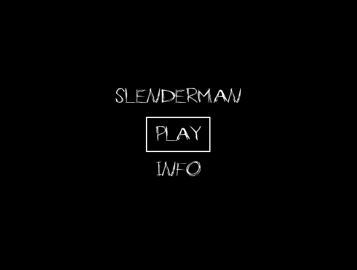
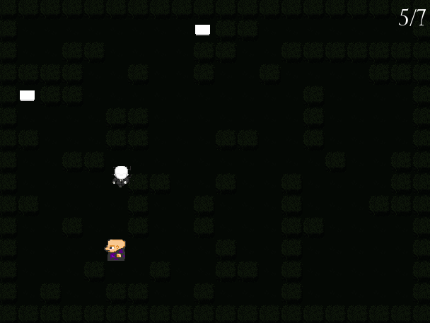
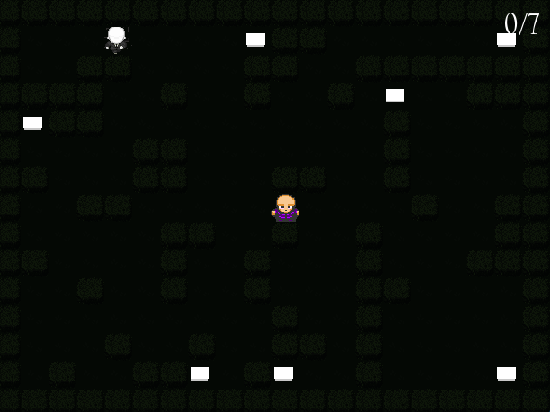

# Slenderman

**Número da Lista**: 37  
**Conteúdo da Disciplina**: Grafos 2  

## Alunos

| Matrícula   | Aluno                          |
| ----------- | ------------------------------ |
| 221037975   | Natália Rodrigues de Morais    |
| 221021975   | Gabriel Santos Monteiro        |

## Sobre

O projeto se trata da evolução do jogo de sobrevivência chamado **Slenderman**, desenvolvido no primeiro módulo, no qual o jogador é perseguido pela criatura Slenderman e deve coletar notas para vencer. Este jogo utiliza conceitos de grafos para construir o mapa e gerenciar o movimento do inimigo.

### Uso de Grafos

Os grafos foram utilizados para modelar o mapa do jogo como uma grade de posições interconectadas, facilitando a movimentação do inimigo em direção ao jogador. A estrutura de grafo também permite que o Slenderman navegue pelo mapa, escolhendo o caminho mais curto para se aproximar do jogador com base no algoritmo de busca em largura (BFS). Cada nó do grafo representa uma posição acessível no mapa, e cada conexão representa uma passagem entre posições adjacentes. Além disso, foi-se utilizado o algoritmo de Dijkstra para melhorar o sistema de pathfinding do inimigo

## Screenshots

| Tela de Introdução                         | Tela de Jogo                               |
| ------------------------------------------ | ------------------------------------------ |
|                     |                       |

| Tela de Início do Jogo                     | Tela de Fim de Jogo                        |
| ------------------------------------------ | ------------------------------------------ |
|                     |                         |

## Instalação 

**Linguagem**: Python  
**Framework**: Pygame  

### Pré-requisitos

1. Python 3.x instalado.
2. Pygame instalado. Você pode instalar usando:
   ```bash
   pip install pygame
   ```

### Rodando o jogo

1. Clone o repositório.
2. Navegue até o diretório do projeto, a pasta Slenderman.
3. Execute o jogo com o comando:
   ```bash
   python main.py
   ```

## Uso

Ao iniciar o jogo, você verá uma tela de introdução com duas opções: **Play** e **Info**.  
1. Pressione **Play** para começar o jogo.
2. Na tela **Info**, você encontrará as instruções de jogo.

### Controles

- `W` / `A` / `S` / `D` ou as setas direcionais para mover-se.
- O objetivo é coletar todas as notas sem ser pego pelo Slenderman.

## Apresentação

Este projeto foi desenvolvido para aplicar conceitos de grafos em uma simulação prática de perseguição e busca.

- [Vídeo de apresentação Grafos 2]()

