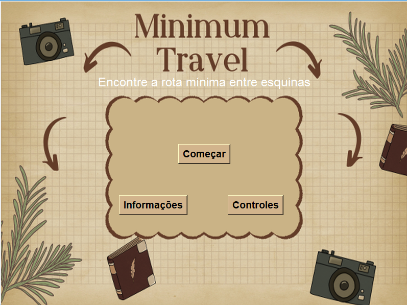
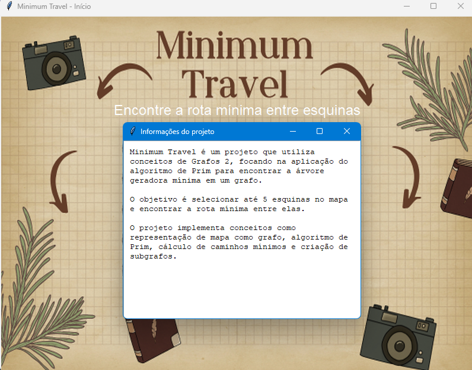
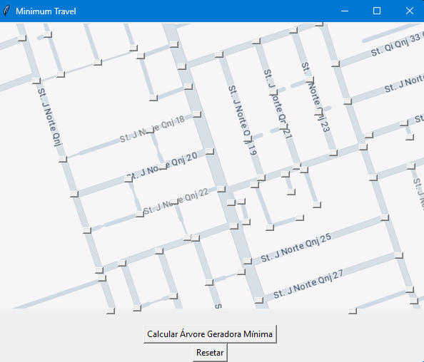
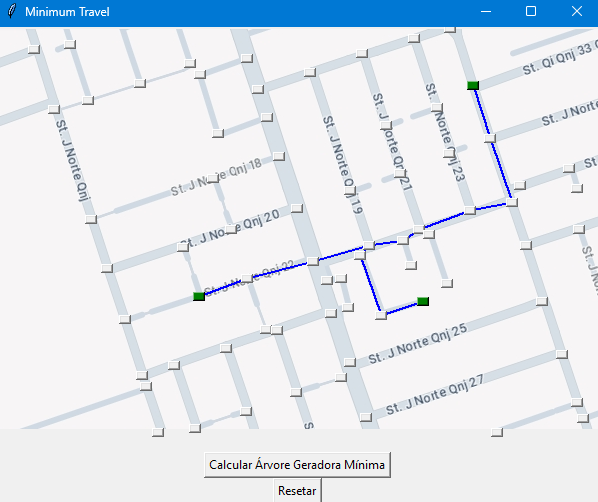

# Minimum Travel

**Número da Lista**: 37  
**Conteúdo da Disciplina**: Grafos 2  

## Alunos

| Matrícula   | Aluno                          |
| ----------- | ------------------------------ |
| 221037975   | Natália Rodrigues de Morais    |
| 221021975   | Gabriel Santos Monteiro        |

## Sobre

O Minimum Travel é um projeto que utiliza conceitos de Grafos 2, focando na aplicação do algoritmo de Prim para encontrar a árvore geradora mínima (Minimum Spanning Tree - MST) em um grafo. O projeto implementa uma interface gráfica interativa que permite aos usuários selecionar esquinas em um mapa e calcular a rota mínima entre elas.

### Uso de Grafos

O projeto implementa os seguintes conceitos de teoria dos grafos:

1. **Representação de Mapa**: O mapa do jogo é modelado como um grafo, onde as esquinas são representadas por nós e as ruas por arestas.

2. **Algoritmo de Prim**: Uma implementação manual do algoritmo de Prim é utilizada para encontrar a árvore geradora mínima do grafo.

3. **Caminhos Mínimos**: O projeto calcula os caminhos mínimos entre esquinas selecionadas usando o algoritmo de caminho mais curto.

4. **Subgrafos**: São criados subgrafos contendo apenas os caminhos relevantes entre as esquinas selecionadas pelo usuário.

## Screenshots

| Tela Inicial                         | Tela das informações                                |
| ------------------------------------------ | ------------------------------------------ |
|                      |                        |

| Tela do mapa                     | Tela do caminho                        |
| ------------------------------------------ | ------------------------------------------ |
|                     |                        |

## Instalação 

**Linguagem**: Python  
**Framework**: Tkinter, PIL, NetworkX

### Pré-requisitos

1. Python 3.x instalado.
2. Instale as bibliotecas necessárias usando:
   ```bash
   pip install tkinter pillow networkx
   ```

### Rodando o projeto

Para executar o projeto, navegue até o diretório do projeto (Minimum_Travel) e execute o arquivo principal:

```bash
python minimum_travel.py
```

## Uso

1. Ao iniciar o programa terá uma tela inicial com as opções de informações do projeto, controles e começar.
2. Se clicar em começar você verá um mapa interativo.
3. Clique em até 5 esquinas no mapa para selecioná-las.
4. Após selecionar as esquinas, o programa calculará e exibirá a rota mínima entre elas.
5. Use o botão de reset para limpar as seleções e começar novamente.

### Controles

- Clique do mouse: Selecionar esquinas
- Botão de reset: Limpar seleções e rota
- Setas indicadoras (< >) (^v) movem o mapa

## Apresentação

- [Vídeo de apresentação Grafos 2]()